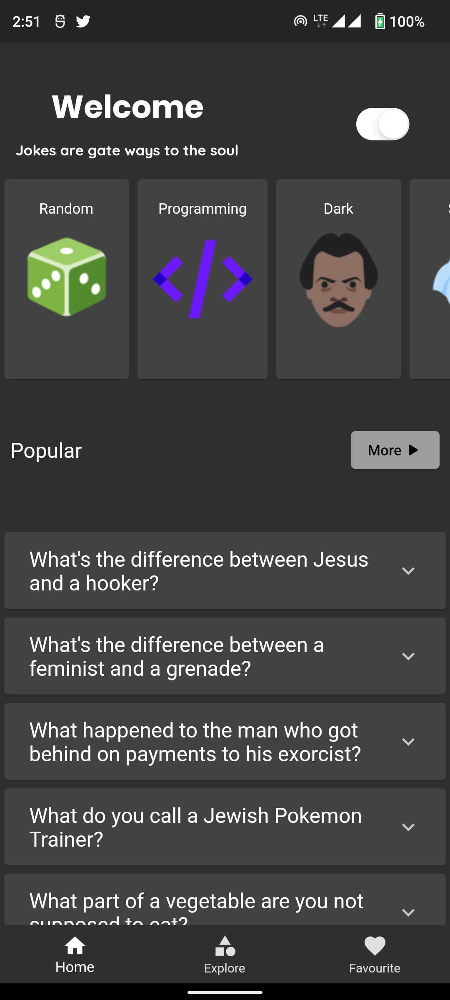
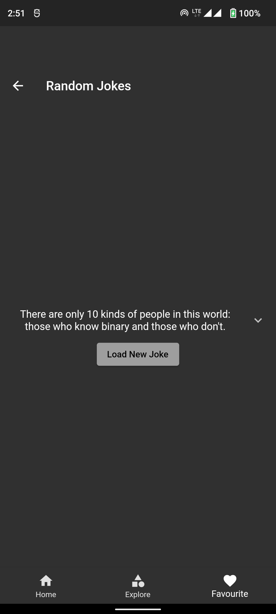

# fun_pluz

An Flutter app built using [Bloc](https://pub.dev/packages/flutter_bloc) and [Provider](https://pub.dev/packages/provider) that consumes [Rapid Api](https://rapidapi.com/hub) to display the current trending, 
upcoming, top rated, and popular memes, jokes and more from the programing ecosystem.

## SetUp 

Create An account with rapid-api and get your Api Key 

```bash
Your-api-key=************
```

## Tech Stack

- [Bloc](https://pub.dev/packages/flutter_bloc) - BlocBuilder is a Flutter widget which requires a bloc and a builder function. BlocBuilder handles building the widget in response to new states. BlocBuilder is very similar to StreamBuilder but has a more simple API to reduce the amount of boilerplate code needed. The builder function will potentially be called many times and should be a pure function that returns a widget in response to the state.
- [Provider](https://pub.dev/packages/provider) - A wrapper around InheritedWidget to make them easier to use and more reusable.
    - By using provider instead of manually writing InheritedWidget, you get:
    - simplified allocation/disposal of resources
    - lazy-loading
    - a vastly reduced boilerplate over making a new class every time
    - devtool friendly – using Provider, the state of your application will be visible in the Flutter devtool
    - a common way to consume these InheritedWidgets (See Provider.of/Consumer/Selector)
    - increased scalability for classes with a listening mechanism that grows exponentially in complexity (such as ChangeNotifier, which is O(N) for dispatching notifications)
  
- [Dark Mode](https://medium.flutterdevs.com/implement-dark-mode-in-flutter-using-provider-158925112bf9#:~:text=There%20are%20two%20ways%20to,dark%20mode%20in%20any%20app%3A&text=We%20already%20have%20both%20the%20options%20in%20flutter.&text=We%20have%20the%20theme%20and,according%20to%20the%20system%20preferences.) - Using providers ChangeNotifierProvider to notify material Ui for changes in the theme.
- [Rapid Api](https://rapidapi.com/hub) where we are fetching most of our programming memes and jokes from
- [Joke api](https://v2.jokeapi.dev) doesn't require an api key

---
# Screenshots

   

---
   

